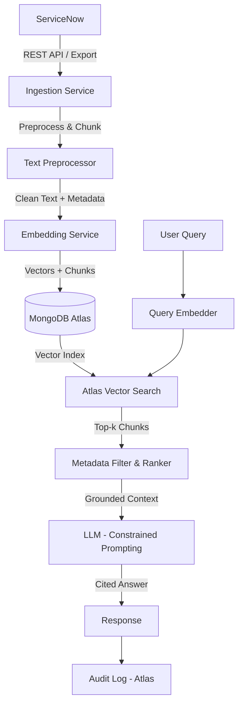
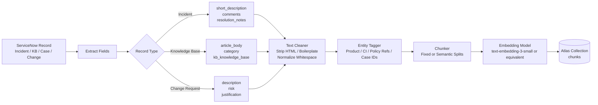
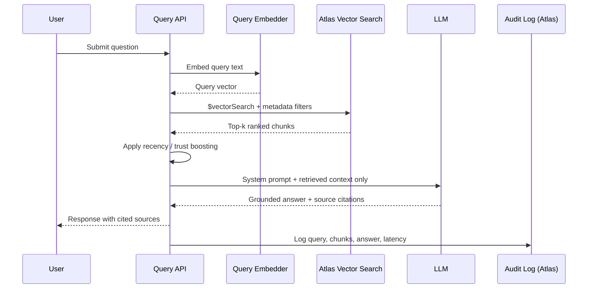
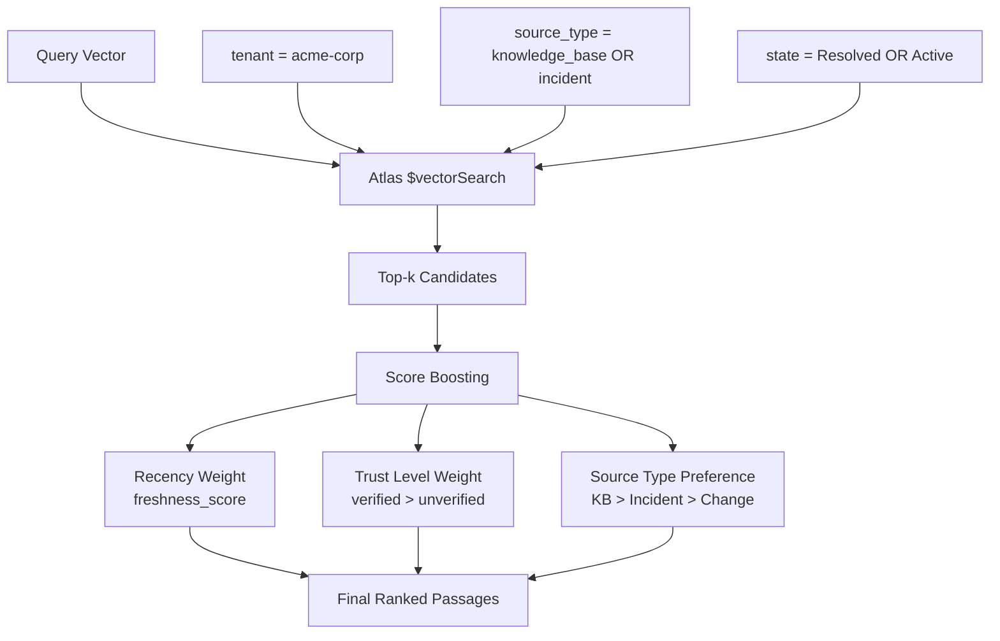

# ServiceNow RAG on MongoDB Atlas

A reference implementation of a Retrieval-Augmented Generation (RAG) pipeline built on MongoDB Atlas, using ServiceNow as the source of record. The system ingests ServiceNow records, generates embeddings, stores them in Atlas Vector Search, and retrieves grounded context for answer generation — minimizing hallucination through constrained, citation-backed responses.

---

## Objective

Design an automated response system that:

- Accepts user input (natural language questions)
- Extracts and preserves meaningful text from ServiceNow records
- Generates embeddings for semantic retrieval
- Stores vectors and source content in MongoDB Atlas
- Retrieves grounded context for response generation
- Minimizes hallucination through constrained, context-only answer generation

---

## Problem Framing

This is not a free-form chat bot. The core requirement is **grounded answer generation** over operational data with:

- High relevance to ServiceNow record content
- Explainability via source citations
- Low hallucination risk through context-constrained prompting
- Operational simplicity — one data platform, not a stitched-together stack

The pattern is: **RAG on Atlas over ServiceNow data**, not a generative assistant.

---

## High-Level Architecture



---

## Ingestion Pipeline



### ServiceNow Fields Targeted

| Record Type | Key Fields Ingested |
|---|---|
| Incident | `short_description`, `description`, `comments`, `close_notes`, `resolution_code` |
| Knowledge Base Article | `text` (article body), `short_description`, `category`, `kb_knowledge_base` |
| Change Request | `description`, `justification`, `risk`, `implementation_plan` |
| Problem | `description`, `workaround`, `cause_notes` |
| Case (CSM) | `subject`, `description`, `comments`, `resolution` |

---

## Atlas Document Schema

Each ingested chunk is stored as a document in MongoDB Atlas:

```json
{
  "_id": "ObjectId",
  "source_id": "INC0012345",
  "source_type": "incident",
  "source_url": "https://instance.service-now.com/nav_to.do?uri=incident.do?sys_id=...",
  "chunk_index": 2,
  "chunk_text": "The VPN client fails to authenticate when MFA is enforced...",
  "embedding": [0.023, -0.114, 0.987, "...1536 dims"],
  "metadata": {
    "product": "VPN",
    "category": "Network",
    "assignment_group": "Network Operations",
    "priority": "2 - High",
    "state": "Resolved",
    "tenant": "acme-corp",
    "trust_level": "verified",
    "created_at": "2025-11-01T09:22:00Z",
    "updated_at": "2026-01-15T14:05:00Z",
    "freshness_score": 0.91
  }
}
```

---

## Atlas Vector Search Index Definition

```json
{
  "name": "servicenow_vector_index",
  "type": "vectorSearch",
  "definition": {
    "fields": [
      {
        "type": "vector",
        "path": "embedding",
        "numDimensions": 1536,
        "similarity": "cosine"
      },
      { "type": "filter", "path": "metadata.source_type" },
      { "type": "filter", "path": "metadata.product" },
      { "type": "filter", "path": "metadata.tenant" },
      { "type": "filter", "path": "metadata.trust_level" },
      { "type": "filter", "path": "metadata.state" }
    ]
  }
}
```

---

## Retrieval and Response Flow



---

## Constrained Prompting Strategy

The LLM is never given open-ended generation latitude. The system prompt enforces:

```
You are a support assistant. Answer only using the provided context passages below.
Do not use external knowledge. If the context does not contain enough information
to answer the question, respond with: "I don't have enough information to answer this."

For every claim, cite the source ID (e.g. [INC0012345], [KB0056789]).

Context:
{retrieved_chunks}

Question:
{user_query}
```

This pattern ensures:

- No hallucination beyond the retrieved corpus
- Every answer is traceable to a ServiceNow record
- The model abstains when evidence is insufficient

---

## Metadata Filtering and Ranking

Atlas Vector Search supports pre-filter and post-filter operations alongside vector similarity, allowing business constraints to be applied without a separate filtering layer.



---

## Why MongoDB Atlas for This Pattern

A ServiceNow RAG workload is not just vector storage. It requires:

| Requirement | Atlas Capability |
|---|---|
| Store source text and metadata | Native document model |
| Store and query vectors | Atlas Vector Search |
| Filter by business attributes (tenant, product, state) | Compound vector + metadata filters |
| Audit log queries and responses | Same cluster, separate collection |
| Freshness / TTL on stale records | TTL indexes |
| Multi-tenant isolation | Field-level filtering or separate namespaces |
| No separate sync pipeline | Data lives where it's queried |

Alternative architectures that separate the operational database, metadata store, and vector database introduce synchronization complexity, consistency risk, and operational overhead that Atlas eliminates.

---

## Repository Structure

```
.
├── ingestion/
│   ├── servicenow_client.py       # ServiceNow REST API client
│   ├── preprocessor.py            # Text cleaning, HTML stripping, chunking
│   ├── embedder.py                # Embedding model wrapper
│   └── atlas_writer.py            # MongoDB Atlas upsert logic
├── retrieval/
│   ├── query_embedder.py          # Embed incoming user queries
│   ├── vector_search.py           # Atlas $vectorSearch aggregation pipeline
│   └── ranker.py                  # Post-retrieval boosting and reranking
├── generation/
│   ├── prompt_builder.py          # Constrained prompt assembly
│   └── llm_client.py              # LLM API wrapper (OpenAI / Azure OAI)
├── api/
│   └── main.py                    # FastAPI query endpoint
├── audit/
│   └── logger.py                  # Atlas audit log writer
├── config/
│   ├── settings.py                # Environment and connection config
│   └── atlas_index.json           # Vector Search index definition
├── tests/
├── .env.example
├── docker-compose.yml
└── README.md
```

---

## Prerequisites

- MongoDB Atlas cluster (M10+) with Vector Search enabled
- ServiceNow instance with REST API access
- OpenAI API key (or compatible embedding + chat model)
- Python 3.10+

---

## Quick Start

```bash
# 1. Clone the repo
git clone https://github.com/your-org/servicenow-rag-atlas.git
cd servicenow-rag-atlas

# 2. Configure environment
cp .env.example .env
# Edit .env with your Atlas URI, ServiceNow credentials, OpenAI key

# 3. Install dependencies
pip install -r requirements.txt

# 4. Run ingestion
python -m ingestion.servicenow_client --record-type incident --days-back 90

# 5. Create Atlas Vector Search index
# Apply config/atlas_index.json via Atlas UI or Atlas CLI

# 6. Start the query API
uvicorn api.main:app --reload

# 7. Query
curl -X POST http://localhost:8000/query \
  -H "Content-Type: application/json" \
  -d '{"question": "How do we resolve VPN MFA failures?", "tenant": "acme-corp"}'
```

---

## Audit and Observability

Every query is logged to a dedicated Atlas collection:

```json
{
  "query_id": "uuid",
  "timestamp": "2026-03-11T10:00:00Z",
  "user_query": "How do we resolve VPN MFA failures?",
  "retrieved_chunks": ["INC0012345:2", "KB0056789:0"],
  "answer": "According to INC0012345, the resolution involves...",
  "latency_ms": 320,
  "feedback": null
}
```

This enables:
- Retrieval quality analysis
- Hallucination auditing (answer vs. retrieved content diff)
- User feedback collection and fine-tuning signal generation

---

## License

MIT
